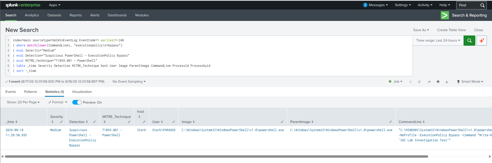
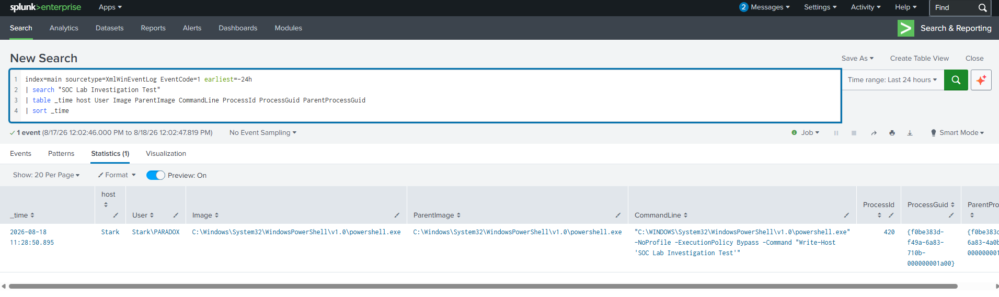
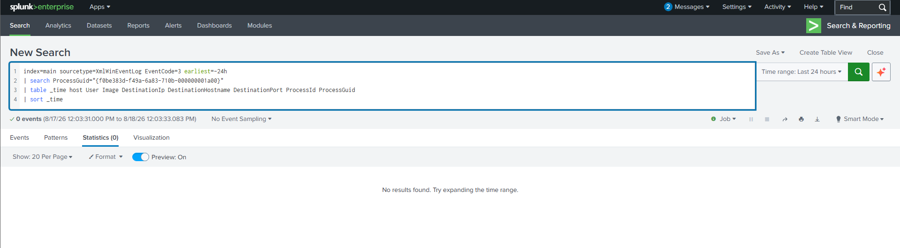
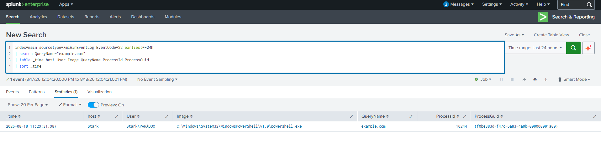
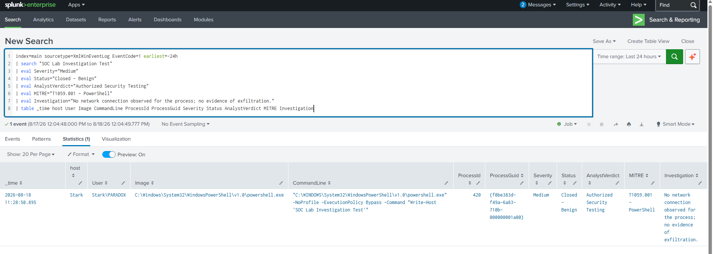

# Suspicious PowerShell Detection & SOC Investigation

A Splunk + Sysmon lab where I detected suspicious PowerShell execution, investigated the process, correlated Sysmon events using `ProcessGuid`, checked for network activity, and closed the alert after validating the activity as authorized testing.

## What I Built

- Windows endpoint with Sysmon
- Splunk Universal Forwarder for log collection
- Splunk Enterprise as the SIEM
- Sysmon Event ID 1 for process creation
- Sysmon Event ID 3 for network connections
- Sysmon Event ID 22 for DNS queries
- SPL detection for PowerShell `ExecutionPolicy Bypass`
- Process-level investigation using `ProcessGuid`

## Lab Flow

````text
Windows Endpoint
       |
       v
     Sysmon
       |
       v
Splunk Universal Forwarder
       |
       | TCP 9997
       v
Splunk Enterprise
       |
       v
Detection -> Investigation -> Correlation -> Disposition
````

## Environment

| Component | Details |
|---|---|
| SIEM | Splunk Enterprise |
| Endpoint | Windows |
| Telemetry | Sysmon |
| Forwarder | Splunk Universal Forwarder |
| Index | `main` |
| Process Creation | Sysmon Event ID 1 |
| Network Connection | Sysmon Event ID 3 |
| DNS Query | Sysmon Event ID 22 |
| Receiving Port | TCP 9997 |

---

## 1. Test Activity

I generated a controlled PowerShell event on the Windows lab machine:

````powershell
powershell.exe -NoProfile -ExecutionPolicy Bypass -Command "Write-Host 'SOC Lab Investigation Test'"
````

The purpose was to generate telemetry that a SOC analyst could investigate.

This was an authorized test inside my lab environment. No malware was used.

The important indicator was:

````text
-ExecutionPolicy Bypass
````

This can be suspicious in an enterprise environment because PowerShell is commonly abused for command and script execution.

I therefore treated the event as suspicious, not automatically malicious.

---

## 2. Splunk Detection

I started with Sysmon Event ID 1 because it records process creation.

### SPL

````spl
index=main sourcetype=XmlWinEventLog EventCode=1 earliest=-24h
| where match(lower(CommandLine), "executionpolicy\s+bypass")
| eval Severity="Medium"
| eval Detection="Suspicious PowerShell - ExecutionPolicy Bypass"
| eval MITRE_Technique="T1059.001 - PowerShell"
| table _time Severity Detection MITRE_Technique host User Image ParentImage CommandLine ProcessId ProcessGuid
| sort -_time
````

### Detection Result

The query identified the PowerShell test:

| Field | Value |
|---|---|
| Host | `Stark` |
| User | `Stark\PARADOX` |
| Process | `powershell.exe` |
| PID | `420` |
| Severity | Medium |
| Detection | Suspicious PowerShell - ExecutionPolicy Bypass |
| MITRE | T1059.001 |

The command line contained:

````text
-NoProfile -ExecutionPolicy Bypass
````

### Screenshot



---

## 3. Process Investigation

After finding the alert, I investigated the process details.

### SPL

````spl
index=main sourcetype=XmlWinEventLog EventCode=1 earliest=-24h
| search "SOC Lab Investigation Test"
| table _time host User Image ParentImage CommandLine ProcessId ProcessGuid ParentProcessGuid
| sort _time
````

This gave me the process information needed for the next stage of the investigation.

### Fields Reviewed

- Timestamp
- Host
- User
- Image
- ParentImage
- CommandLine
- ProcessId
- ProcessGuid
- ParentProcessGuid

### Screenshot



---

## 4. PID Reuse and ProcessGuid

One useful finding during the investigation was that PID `420` was not enough to identify the process.

I found that PID `420` had previously been used by another process and later appeared on the PowerShell event.

That means a query based only on:

````text
ProcessId=420
````

can potentially correlate unrelated events.

I therefore used the Sysmon `ProcessGuid` associated with the PowerShell process.

This gave me a much more reliable way to investigate activity belonging to that specific process.

---

## 5. Network Investigation

Next, I checked whether the specific PowerShell process created a network connection.

The ProcessGuid from the PowerShell event was:

````text
{f0be383d-f49a-6a83-710b-000000001a00}
````

### SPL

````spl
index=main sourcetype=XmlWinEventLog EventCode=3 earliest=-24h
| search ProcessGuid="{f0be383d-f49a-6a83-710b-000000001a00}"
| table _time host User Image DestinationIp DestinationHostname DestinationPort ProcessId ProcessGuid
| sort _time
````

### Result

````text
0 events
````

No Sysmon Event ID 3 network connection was observed for this specific PowerShell process during the investigation window.

This meant I had no evidence of a network connection originating from the detected PowerShell process.

### Screenshot



---

## 6. DNS Investigation

I also investigated DNS activity separately.

### SPL

````spl
index=main sourcetype=XmlWinEventLog EventCode=22 earliest=-24h
| search QueryName="example.com"
| table _time host User Image QueryName ProcessId ProcessGuid
| sort _time
````

A DNS query for `example.com` was present in the logs.

However, the ProcessGuid associated with that DNS event did not match the ProcessGuid of the suspicious PowerShell process.

I therefore did not attribute the DNS activity to the PowerShell alert.

This was important because two events on the same host should not automatically be treated as related without supporting evidence.

### Screenshot



---

## 7. Investigation Summary

| Check | Result |
|---|---|
| Suspicious PowerShell detected | Yes |
| `ExecutionPolicy Bypass` present | Yes |
| Process investigated | Yes |
| ProcessGuid identified | Yes |
| Network connection from specific process | None observed |
| DNS activity found | Yes |
| DNS linked to PowerShell process | No |
| Malicious payload observed | No |
| Exfiltration evidence | None observed |
| Activity | Authorized lab testing |
| Final disposition | Benign |

---

## 8. MITRE ATT&CK

### T1059.001 — Command and Scripting Interpreter: PowerShell

The detected activity maps to:

**T1059.001 — PowerShell**

The technique was identified from the PowerShell process creation telemetry collected by Sysmon.

---

## 9. Final SOC Disposition

### Alert

**Suspicious PowerShell - ExecutionPolicy Bypass**

### Severity

**Medium**

### Investigation Result

The PowerShell command was part of an authorized lab test.

I investigated the specific process using its `ProcessGuid` and checked for associated network activity.

No Sysmon Event ID 3 network connection was found for that process.

The DNS activity found during the investigation belonged to a different ProcessGuid and was not correlated with the PowerShell process.

### Final Verdict

**Closed - Benign / Authorized Security Testing**

### Escalation

**Not required**

### Screenshot



---

## 10. Investigation Timeline

````text
PowerShell executed
       |
       v
ExecutionPolicy Bypass detected
       |
       v
Splunk alert generated
       |
       v
Process investigated
       |
       v
ProcessGuid identified
       |
       v
Network activity checked
       |
       v
No associated network connection
       |
       v
DNS activity checked separately
       |
       v
Different ProcessGuid
       |
       v
Authorized lab activity confirmed
       |
       v
Alert closed as benign
````

---

## 11. What I Learned

### Process IDs are not enough

Windows can reuse PIDs, so I learned to use Sysmon `ProcessGuid` when correlating process-related events.

### Suspicious does not mean malicious

`ExecutionPolicy Bypass` is a useful detection indicator, but it needs context and investigation before an alert should be escalated.

### Correlation needs evidence

The DNS event was on the same host, but its ProcessGuid was different. I did not associate it with the PowerShell alert without supporting evidence.

### Detection is only the first step

The useful part of a SOC workflow is not just generating an alert. The analyst needs to investigate it and reach a defensible disposition.

---

## 12. Skills Used

- Splunk Enterprise
- SPL
- Sysmon
- Windows Event Logs
- PowerShell Monitoring
- Process Investigation
- ProcessGuid Correlation
- Network Investigation
- DNS Investigation
- SOC L1 Alert Triage
- Incident Investigation
- MITRE ATT&CK
- False Positive Analysis
- Alert Disposition

---

## 13. Repository Structure

````text
Suspicious-PowerShell-Detection-SOC-Investigation/
│
├── README.md
│
└── screenshots/
    ├── 01-suspicious-powershell-detection.png
    ├── 02-process-investigation.png
    ├── 03-network-correlation.png
    ├── 04-dns-investigation.png
    └── 05-final-disposition.png
````

---

## Conclusion

I built this lab to practice a basic SOC investigation around suspicious PowerShell activity.

The investigation started with a PowerShell `ExecutionPolicy Bypass` detection. I then investigated the process, noticed the PID reuse issue, switched to `ProcessGuid` for correlation, checked for network activity, and investigated the DNS event separately.

The specific PowerShell process had no observed Sysmon Event ID 3 network connection. The DNS activity found during the investigation belonged to a different ProcessGuid, so I did not associate it with the PowerShell alert.

The activity was confirmed as an authorized lab test.

**Final Result: Suspicious PowerShell detected → Investigated → No associated network connection observed → Authorized activity confirmed → Alert closed as benign.**
